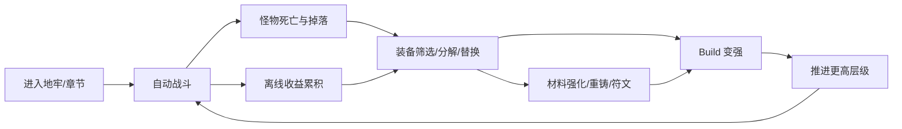
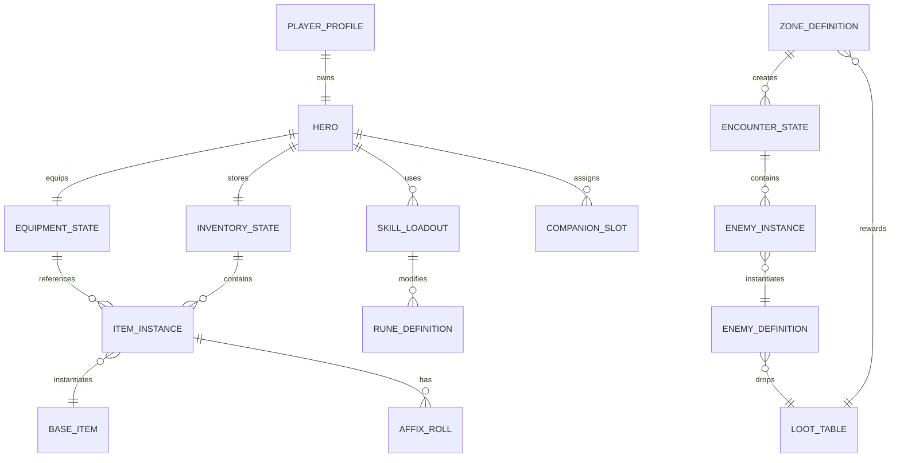

# 横版暗黑 2.5D 挂机刷宝 ARPG：策划与技术方案

## 1. 项目定位

项目代号：`Forge Lane`

目标体验：一款打开即战斗的横版 2.5D 暗黑刷宝游戏。玩家不直接操作移动，而是围绕“自动战斗 + 技能策略 + 装备构筑 + 离线收益”做决策。核心快感来自持续掉落、词缀筛选、Build 成型、推层和赛季重开。

参考维度：

- 《英雄没有闪》公开资料强调“竖屏横版卷轴 + 放置 ARPG + 轻松刷宝 + 流派搭配”，包括技能、符文、套装词缀、离线收益等方向。
- 本项目不复刻其题材和表现，而是吸收“低操作门槛、高构筑密度、自动战斗可观察”的设计优势。
- 美术方向改为暗黑 2.5D：低饱和地牢、火光、腐化、铁匠铺、哥特式 UI、斜俯视角色层次和横向推进镜头。

## 2. 核心设计原则

1. 玩家主要操作不是走位，而是构筑。
2. 战斗过程必须可读：怪物、技能、掉落、伤害类型和危险状态要在舞台上看得出来。
3. 掉落要频繁，但有效提升要稀缺。
4. 所有成长系统都要能回到 Build：装备、技能、符文、随从、天赋、祭坛都服务于流派。
5. 离线收益不能替代在线决策：离线给资源和装备，在线提供 Boss、筛选、挑战和关键掉落效率。
6. 赛季制优先于无限堆数值：让玩家定期回到新规则、新词缀和新目标。

## 3. 目标玩家与核心循环

目标玩家：

- 喜欢暗黑、流放之路、火炬之光式装备词缀和刷宝的人。
- 喜欢挂机/放置，但希望 Build 决策有深度的人。
- 希望碎片时间也能推进，长时间在线也有优化空间的人。

核心循环：



## 4. 游戏视角与表现

### 4.1 2.5D 暗黑横版

画面不是纯平台跳跃横版，而是“横向推进 + 斜俯视地面”的 2.5D 舞台：

- 镜头固定横向，角色在屏幕左中区域，敌人从右侧压入。
- 地面使用斜向网格、阴影椭圆、脚底层级制造深度。
- 技能特效允许前后景穿插，例如旋风、毒雾、骨刺、火墙。
- 装备掉落以地面光柱和 UI 卡片双重呈现。

### 4.2 视觉主题

- 场景：废弃矿道、诅咒修道院、瘟疫沼泽、熔炉裂隙、深渊王座。
- UI：铁、皮革、羊皮纸、暗金边框、红/蓝/绿/金稀有度。
- 角色：轮廓清晰，动作循环短促，重视命中反馈。
- 敌人：用体型、颜色、光效表达词缀和威胁。

## 5. 玩法系统设计

### 5.1 自动战斗

战斗以固定 tick 驱动。每个 tick 做以下结算：

1. 时间推进。
2. Buff/Debuff 持续时间衰减。
3. 自动普攻计时。
4. 自动技能策略判断。
5. 投射物、持续区域、召唤物结算。
6. 敌方行动结算。
7. 死亡、掉落、推进、任务更新。

玩家可配置“技能策略”，例如：

- 有精英时释放。
- 敌人数量大于 5 时释放。
- 生命低于 40% 时释放。
- 冷却好了就释放。
- 保留给 Boss。

### 5.2 职业与英雄

首发建议 3 个职业：

- 破誓骑士：近战、格挡、流血、火焰圣印。
- 灰烬术士：火焰、混沌、召唤、献祭。
- 夜刃游侠：毒、连击、暴击、陷阱。

职业不强绑定装备类型，但提供核心被动和技能池。长期可做转职/升华。

### 5.3 技能、符文与流派

技能由 `Skill` 定义基础行为，由 `Rune` 修改机制：

- 原力锤：近战范围打击。
- 骨矛：穿透投射物。
- 腐毒新星：以自身为中心扩散毒伤。
- 地狱火墙：持续区域伤害。
- 影袭：单体高暴击。
- 召唤骸骨：持续召唤物。

符文示例：

- 多重：投射物数量 +2，但单发伤害降低。
- 回响：技能延迟再次释放一次。
- 腐化：部分伤害转为毒，并附加持续伤害。
- 献祭：消耗生命换取额外伤害。
- 守护：释放后获得护盾。

Build 示例：

- 流血斩杀流：高攻速 + 流血叠层 + 斩杀阈值。
- 毒云召唤流：召唤物触发毒爆，靠持续伤害推层。
- 火墙暴击流：火墙叠燃烧，暴击刷新持续时间。
- 格挡反击流：堆格挡和护甲，靠反击与荆棘伤害刷怪。

### 5.4 装备与词缀

装备槽位：

- 武器
- 副手
- 头盔
- 胸甲
- 手套
- 靴子
- 项链
- 戒指 1
- 戒指 2
- 遗物

稀有度：

- 普通：基础属性。
- 魔法：1-2 条词缀。
- 稀有：3-5 条词缀。
- 史诗：固定特殊词缀 + 随机词缀。
- 传说：改变技能机制或核心规则。
- 暗金/套装：围绕流派成套构筑。

词缀池按类型分组：

- 攻击：物理伤害、元素伤害、攻速、暴击、暴伤。
- 防御：生命、护甲、抗性、格挡、护盾。
- 技能：指定技能等级、冷却缩减、范围、投射物。
- 资源：怒气/法力生成、消耗降低。
- 掉落：魔法发现、金币获取、材料获取。
- 特殊：击杀触发、受击触发、Boss 增伤、精英减伤。

装备价值公式：

```text
itemScore =
  basePower * slotWeight
  + offensiveScore
  + defensiveScore
  + buildSynergyScore
  + rarityBonus
```

注意：`itemScore` 只用于排序提示，不替代玩家判断。带机制改变的低分传奇可能是核心装备。

### 5.5 掉落与筛选

掉落由 `LootTable` 控制：

- 地区决定基础装备池。
- 怪物类型决定主题词缀权重。
- 难度决定物品等级和高稀有度概率。
- 玩家寻宝值影响稀有度，但不应线性爆炸。

掉落筛选：

- 自动分解低稀有度。
- 保留指定槽位。
- 保留包含指定词缀的装备。
- 高于当前装备评分才入包。
- 传说/套装永远保留。

### 5.6 地牢、章节与 Boss

地牢结构：

- 章节：一组主题关卡。
- 层级：挂机推进单位。
- 节点：普通、精英、事件、宝箱、Boss。
- Boss：检测 Build 是否完整的门槛。

关卡推进：

```text
Chapter -> Zone -> Stage -> Encounter -> Wave -> Enemy
```

每 10 层一个小 Boss，每 50 层一个章节 Boss。Boss 掉落可绑定特定传奇、符文和材料。

### 5.7 随从系统

随从不是主战角色，而是 Build 辅助：

- 铁匠学徒：提高分解收益，降低重铸成本。
- 修女：提供治疗、净化和护盾。
- 猎魔人：补充单体暴击与精英增伤。
- 亡灵书吏：提高符文经验和诅咒效果。

随从拥有：

- 主动技能
- 被动光环
- 装备槽
- 羁绊标签

### 5.8 经济与材料

货币：

- 金币：基础强化、购买、普通重铸。
- 裂片：分解装备获得，用于技能过载和词缀锁定。
- 混沌石：重随机词缀。
- 余烬：升级符文。
- 灵魂灰：传说萃取与暗金打造。

经济原则：

- 金币常缺但不阻塞。
- 高级材料来自挑战和分解，不直接靠纯挂机无限产出。
- 重铸要可控：允许锁 1-2 条词缀，但成本快速上升。

### 5.9 离线收益

离线收益计算：

```text
offlineReward =
  min(offlineSeconds, offlineCap)
  * estimatedKillsPerSecond
  * rewardEfficiency
```

限制：

- 免费上限 8 小时。
- Boss 不在线自动突破，只能离线刷已通过层。
- 离线掉落进入“待鉴定箱”，玩家上线后统一筛选。

## 6. 系统架构

### 6.1 前端模块

建议目录：

```text
src/
  app/
    App.tsx
    gameStore.ts
  data/
    items.ts
    skills.ts
    enemies.ts
    lootTables.ts
    affixes.ts
  engine/
    combatLoop.ts
    damage.ts
    loot.ts
    progression.ts
    offline.ts
    rng.ts
  domain/
    types.ts
    ids.ts
    formulas.ts
  ui/
    StageView.tsx
    InventoryPanel.tsx
    EquipmentPanel.tsx
    SkillPanel.tsx
    LootFilterPanel.tsx
    CombatLog.tsx
  persistence/
    saveCodec.ts
    migrations.ts
```

### 6.2 分层职责

- `data`：静态配置，不包含运行时状态。
- `domain`：实体类型和纯公式。
- `engine`：纯函数游戏结算，输入状态输出新状态。
- `persistence`：存档、版本迁移和离线结算。
- `ui`：只负责展示和发出玩家意图。
- `app`：组合 store、路由和全局状态。

### 6.3 状态管理

当前原型可继续使用 React state。进入下一阶段建议使用 Zustand 或 Redux Toolkit，但核心 engine 保持纯函数，便于测试和将来迁移到服务端。

状态分为：

- `GameState`：运行时状态。
- `StaticData`：配置表。
- `DerivedStats`：从角色、装备、技能推导出的战斗属性。
- `UiState`：当前打开面板、筛选条件、选中物品。

## 7. 实体结构定义

### 7.1 基础类型

```ts
type EntityId = string
type Timestamp = number

type Rarity =
  | 'normal'
  | 'magic'
  | 'rare'
  | 'epic'
  | 'legendary'
  | 'set'

type DamageType =
  | 'physical'
  | 'fire'
  | 'cold'
  | 'lightning'
  | 'poison'
  | 'shadow'
  | 'holy'

type StatKey =
  | 'life'
  | 'armor'
  | 'block'
  | 'attackSpeed'
  | 'castSpeed'
  | 'critChance'
  | 'critDamage'
  | 'cooldownReduction'
  | 'magicFind'
  | 'goldFind'
  | 'allResistance'
```

### 7.2 玩家与英雄

```ts
interface PlayerProfile {
  id: EntityId
  accountName: string
  createdAt: Timestamp
  lastSeenAt: Timestamp
  seasonId: EntityId
  settings: PlayerSettings
}

interface Hero {
  id: EntityId
  name: string
  classId: EntityId
  level: number
  xp: number
  paragonLevel: number
  resources: ResourceState
  equipment: EquipmentState
  skills: SkillLoadout
  talents: TalentState
  companions: CompanionSlot[]
}

interface ResourceState {
  gold: number
  shards: number
  chaosStones: number
  ember: number
  soulAsh: number
}
```

### 7.3 装备与词缀

```ts
interface ItemInstance {
  id: EntityId
  baseItemId: EntityId
  slot: EquipmentSlot
  rarity: Rarity
  itemLevel: number
  requiredLevel: number
  affixes: AffixRoll[]
  sockets: SocketState[]
  setId?: EntityId
  legendaryPowerId?: EntityId
  boundToHeroId?: EntityId
  createdAt: Timestamp
}

interface BaseItem {
  id: EntityId
  name: string
  slot: EquipmentSlot
  tags: string[]
  implicitStats: StatModifier[]
  allowedAffixGroups: EntityId[]
  icon: string
}

interface AffixRoll {
  affixId: EntityId
  tier: number
  values: number[]
  locked?: boolean
}

interface StatModifier {
  stat: StatKey
  op: 'add' | 'multiply' | 'more'
  value: number
  condition?: ModifierCondition
}

type EquipmentSlot =
  | 'weapon'
  | 'offhand'
  | 'helm'
  | 'chest'
  | 'gloves'
  | 'boots'
  | 'amulet'
  | 'ring1'
  | 'ring2'
  | 'relic'

type EquipmentState = Record<EquipmentSlot, EntityId | null>
```

### 7.4 技能、符文、Buff

```ts
interface SkillDefinition {
  id: EntityId
  name: string
  tags: string[]
  damageTypes: DamageType[]
  baseCooldownMs: number
  resourceCost: number
  targeting: TargetingRule
  effects: SkillEffect[]
}

interface SkillLoadout {
  basicSkillId: EntityId
  activeSkillIds: EntityId[]
  runeBySkillId: Record<EntityId, EntityId[]>
  automationRules: SkillAutomationRule[]
}

interface RuneDefinition {
  id: EntityId
  name: string
  targetSkillTags: string[]
  modifiers: SkillModifier[]
}

interface BuffInstance {
  id: EntityId
  sourceEntityId: EntityId
  targetEntityId: EntityId
  buffDefId: EntityId
  stacks: number
  expiresAt: number
  modifiers: StatModifier[]
}
```

### 7.5 敌人、遭遇与关卡

```ts
interface EnemyDefinition {
  id: EntityId
  name: string
  family: 'undead' | 'demon' | 'beast' | 'cultist' | 'construct'
  rank: 'minion' | 'normal' | 'elite' | 'boss'
  baseStats: CombatStats
  skills: EntityId[]
  affixPoolId?: EntityId
  lootTableId: EntityId
}

interface EnemyInstance {
  id: EntityId
  enemyDefId: EntityId
  level: number
  currentLife: number
  maxLife: number
  affixes: EntityId[]
  buffs: BuffInstance[]
  position: Vec2
  state: 'spawning' | 'active' | 'dead'
}

interface EncounterState {
  id: EntityId
  zoneId: EntityId
  stage: number
  waveIndex: number
  enemies: EnemyInstance[]
  startedAt: number
}

interface ZoneDefinition {
  id: EntityId
  chapterId: EntityId
  name: string
  biome: string
  enemyFamilies: string[]
  lootTableId: EntityId
  bossEveryStages: number
}
```

### 7.6 背包、掉落与筛选

```ts
interface InventoryState {
  capacity: number
  itemIds: EntityId[]
  pendingOfflineLootIds: EntityId[]
  filter: LootFilterRule[]
}

interface LootTable {
  id: EntityId
  entries: LootEntry[]
}

interface LootEntry {
  kind: 'item' | 'currency' | 'rune' | 'material'
  refId: EntityId
  weight: number
  minLevel?: number
  maxLevel?: number
  conditions?: DropCondition[]
}

interface LootFilterRule {
  id: EntityId
  priority: number
  action: 'keep' | 'salvage' | 'notify'
  conditions: LootFilterCondition[]
}
```

### 7.7 战斗状态

```ts
interface CombatState {
  tick: number
  elapsedMs: number
  heroSnapshot: CombatantSnapshot
  companionSnapshots: CombatantSnapshot[]
  encounter: EncounterState
  projectiles: ProjectileInstance[]
  areaEffects: AreaEffectInstance[]
  combatLog: CombatLogEntry[]
}

interface CombatantSnapshot {
  entityId: EntityId
  stats: CombatStats
  currentLife: number
  currentShield: number
  resources: Record<string, number>
  cooldowns: Record<EntityId, number>
  buffs: BuffInstance[]
}

interface CombatStats {
  life: number
  damage: Partial<Record<DamageType, number>>
  armor: number
  resistances: Partial<Record<DamageType, number>>
  attackSpeed: number
  castSpeed: number
  critChance: number
  critDamage: number
  block: number
  cooldownReduction: number
  magicFind: number
}
```

## 8. 实体关系



## 9. 关键结算流程

### 9.1 战斗 Tick

```ts
function advanceCombat(state: GameState, data: StaticData, deltaMs: number): GameState {
  const derived = deriveHeroStats(state.hero, state.items, data)
  const withCooldowns = updateCooldowns(state, deltaMs)
  const withPlayerActions = resolveAutomationRules(withCooldowns, derived, data)
  const withProjectiles = updateProjectiles(withPlayerActions, deltaMs, data)
  const withAreas = updateAreaEffects(withProjectiles, deltaMs, data)
  const withEnemies = resolveEnemyActions(withAreas, deltaMs, data)
  const withDeaths = resolveDeathsAndDrops(withEnemies, data)
  return progressEncounterIfNeeded(withDeaths, data)
}
```

### 9.2 伤害公式

```text
baseDamage = skillBase * (1 + additiveIncreased)
typedDamage = baseDamage * damageTypeMultiplier
critDamage = typedDamage * (isCrit ? critMultiplier : 1)
mitigated = critDamage * armorOrResistanceReduction
finalDamage = mitigated * moreMultipliers * enemyTakenMultiplier
```

设计约束：

- `increased` 加法堆叠，`more` 乘法堆叠。
- 暴击、攻速、冷却、范围、持续时间都要有收益递减或软上限。
- 怪物反伤要明显提示，避免挂机突然死亡但玩家不知道原因。

### 9.3 掉落流程

```text
kill enemy
  -> collect candidate loot tables
  -> roll currency/material
  -> roll item base
  -> roll rarity
  -> roll affix count
  -> roll affix groups and tiers
  -> apply magic-find modifiers
  -> apply loot filter
  -> insert into inventory or salvage result
```

### 9.4 离线流程

```text
load save
  -> calculate offline duration
  -> clamp by cap
  -> estimate clear speed from latest passed stage
  -> simulate aggregate kills, gold, materials
  -> roll batched loot with reduced boss access
  -> write pending offline rewards
```

## 10. 存档与版本迁移

存档格式：

```ts
interface SaveGame {
  version: number
  profile: PlayerProfile
  hero: Hero
  inventory: InventoryState
  itemsById: Record<EntityId, ItemInstance>
  progression: ProgressionState
  unlockedSystems: string[]
  lastSavedAt: Timestamp
}
```

迁移策略：

- 每次改实体结构递增 `version`。
- `migrations.ts` 按版本顺序迁移。
- 静态表只存 `id`，不把完整配置写入存档。
- 删除配置时保留兼容映射，例如旧技能 `fireball_v1` -> 新技能 `hellfire_orb`。

## 11. 数值推进框架

建议分阶段：

### 前 30 分钟

- 高频掉落。
- 每 1-2 分钟一次明显替换。
- 解锁分解、技能符文、自动策略。

### 第 1 天

- 完成第一章。
- 获得第一件传说或套装核心。
- 出现第一个 Build 分叉。

### 第 3-7 天

- 开始追词缀、Boss 专属掉落、随从组合。
- 解锁试炼地牢、材料本、赛季任务。

### 长线

- 高层推图。
- 暗金收集。
- Build 排行。
- 赛季词缀。

## 12. MVP 开发路线

### M0：当前原型

- React 页面。
- 自动战斗。
- 简单装备、掉落、分解、离线收益。

### M1：数据驱动

- 拆出 `domain/types.ts`、`engine/*`、`data/*`。
- 静态配置表驱动怪物、装备和掉落。
- 为战斗、掉落、离线收益添加单元测试。

### M2：Build 原型

- 加入 6 个主动技能。
- 加入技能符文。
- 加入 20-40 条词缀。
- 加入装备筛选规则。

### M3：2.5D 地牢表现

- Stage 组件拆分。
- 角色、敌人、投射物、地面光柱。
- 伤害数字、异常状态、精英词缀提示。

### M4：章节与 Boss

- 3 个章节。
- 15 种怪物。
- 3 个章节 Boss。
- Boss 专属掉落。

### M5：长期系统

- 随从。
- 套装。
- 重铸。
- 赛季词缀。
- 云存档或后端账号。

## 13. 技术风险与应对

- 数值膨胀：公式分层，控制乘区数量，为每个系统设预算。
- 掉落无聊：传说必须改变机制，不只是加数值。
- 挂机无反馈：舞台上必须持续显示技能、掉落、濒危和推进变化。
- 存档破坏：早做版本迁移和回滚备份。
- UI 复杂：背包、筛选、装备对比要优先做信息密度，而不是装饰。
- 性能压力：战斗 engine 用聚合结算，离线不逐 tick 模拟。

## 14. 下一步实施建议

优先把当前单文件原型改造成可扩展架构：

1. 抽出完整实体类型到 `src/domain/types.ts`。
2. 把战斗推进改成 `src/engine/combatLoop.ts` 纯函数。
3. 把掉落改成 `src/engine/loot.ts`，并建立 `src/data/lootTables.ts`。
4. 把装备和词缀配置化。
5. 加入 Vitest，先覆盖掉落、伤害和离线收益。
6. 再改 UI，不要先堆美术细节。

这样做的好处是：后续不管继续做网页原型、Electron、小程序，还是迁移到 Unity/Godot，核心数据和公式都能保留。
